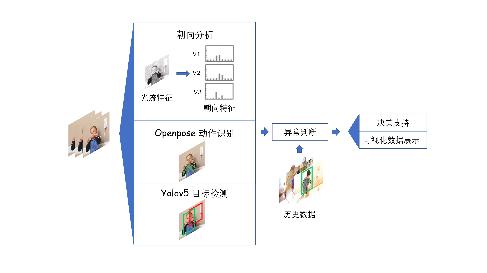

# Intelli KID Guardian


For the application of child monitoring, we use the intelligent hardware platform to collect and analyze the family environment data, and combine with the IOT application platform to realize visual data display and real-time video monitoring on the APP, and use artificial intelligence on this basis. The secondary development of intelligent technology realizes the accurate detection of children's status.


## Demo
To run the demo from a webcam:

```python
python pose_detect.py --checkpoint-path <path_to>/checkpoint_iter_370000.pth --video 0
```
The code of Intelli-KID-Guardian is developed based on the code of [Lightweight-OpenPose-PyTorch](https://github.com/ModelBunker/Lightweight-OpenPose-PyTorch) and [yolov5](https://github.com/ultralytics/yolov5)
